# Online Chatbot Ticket Booking System 
**Developed for Smart India Hackathon (SIH) 2024 – Ministry of Culture**

<div style="float: right; margin-left: 20px;">
  
</div>

The **Online Chatbot Ticket Booking System** for Museums is an AI-driven web application designed to simplify the museum ticketing experience through a conversational interface. Developed under the **Ministry of Culture** problem statement for **Smart India Hackathon 2024**, this solution eliminates long queues, minimizes paper usage, and enhances accessibility for visitors across India.

The system enables users to **book tickets using natural language chat—either text or voice—making** the process intuitive and inclusive. The **chatbot** supports multiple Indian languages using the Google Translator module, ensuring accessibility for diverse audiences. Once a booking is confirmed, users receive a **QR-based digital ticket**, stored securely in their ticket history for future access.

The platform integrates **Razorpay** for secure online payments and is powered by **Rasa**, **Django**, and **PostgreSQL**, with **Docker** for deployment. Its user-friendly interface, real-time responses, and robust security make it a scalable solution for nationwide museum ticket management.
## Workflow
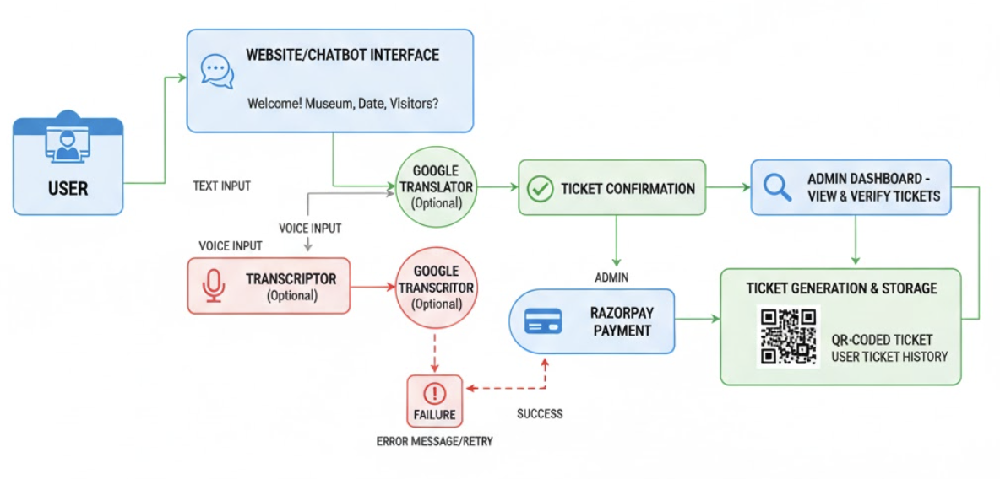

## Features

The **Chat-bot** offers the following features:

- 🤖 **AI-Powered Chatbot**: Built with Rasa for intelligent, standalone conversational ticketing (no paid APIs).
- 🗣️ **Voice-Based Booking**: Supports speech-to-text for hands-free ticket booking.
- 🌍 **Multilingual Support**: Leverages Google Translator API for seamless communication in multiple languages.
- 🧾 **QR Code Ticketing**: Generates and validates QR code-based tickets for secure entry.
- 💳 **Payment Integration**: Integrates Razorpay for secure and efficient payment processing.
- 📜 **Ticket History Management**: Tracks and manages user ticket history for easy access.
- 🛡️ **Secure Authentication**: Implements SSL/TLS for safe data handling and user authentication.
- 🌐 **Admin Panel**: Provides a museum management interface for ticketing and operations.


## Tech Stack
- **Frontend**: HTML, CSS, Bootstrap for responsive and modern user interfaces.
- **Backend**: Django and Django REST Framework for robust server-side logic and API development.
- **Database**: PostgreSQL for scalable and reliable data storage.
- **Chatbot Engine**: Rasa (Standalone) for intelligent, open-source conversational AI.
- **APIs**: Google Translator for multilingual support, Razorpay for secure payment processing.
- **Security**: SSL/TLS and Django Security Middleware for safe data handling and authentication.
- **Version Control**: Git and GitHub for collaborative development and code management.


## Project Setup

Run the following command

**Step 1: Clone the Repository**

```bash
#Clone the Project 
git clone https://github.com/adhilogu/online_chatbot_ticketing_system.git

# Navigate to Django directory 
cd django-soft-ui-design

# Create virtual environment (recommended) 
python -m venv venv

# Activate virtual environment
# On Windows:
venv\Scripts\activate

# On macOS/Linux:
source venv/bin/activate

# Install dependencies
pip install -r requirements.txt

# Configure database settings in settings.py
# Update DATABASES configuration with your PostgreSQL credentials or use sqlite
```

**Step 2: Project setup**
```bash
# Run migrations
python manage.py makemigrations
python manage.py migrate
python manage.py collectstatic
```

```bash
# Create superuser (admin)
python manage.py createsuperuser
```

**Step 3: Start server**

*In Terminal 1*
```bash
python manage.py runserver 8000
```

At this point, the app runs at https://127.0.0.1:8000/

*In Terminal 2*
```bash
cd rasabot1
rasa run -m models --enable-api --cors "*"
```

*To train the rasa model:*
```bash
rasa train
```

Admin panel at  https://127.0.0.1:8000/admin

## [Snapshots of the project]

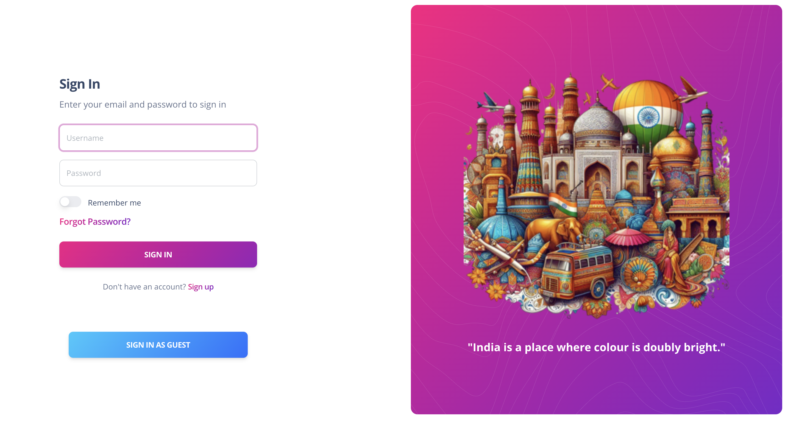
Login page

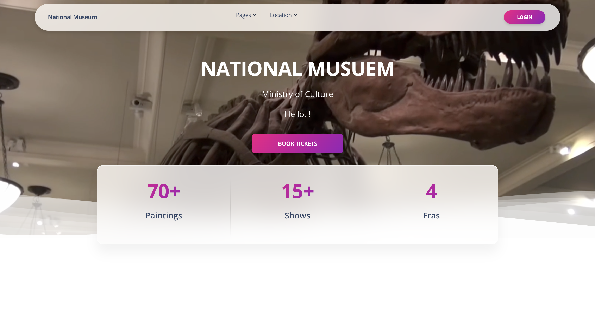
Home page

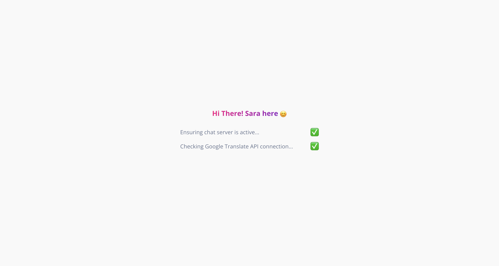
Checking all the connectivity

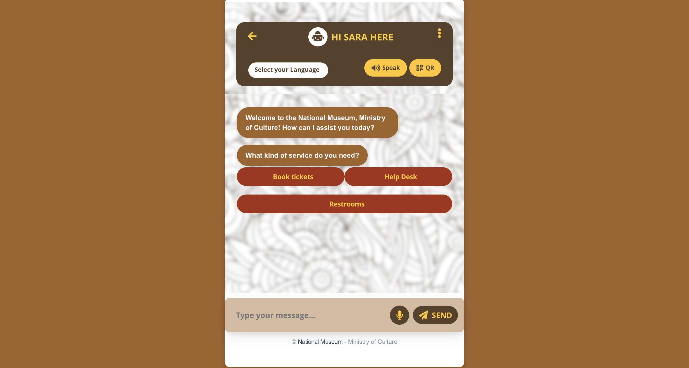
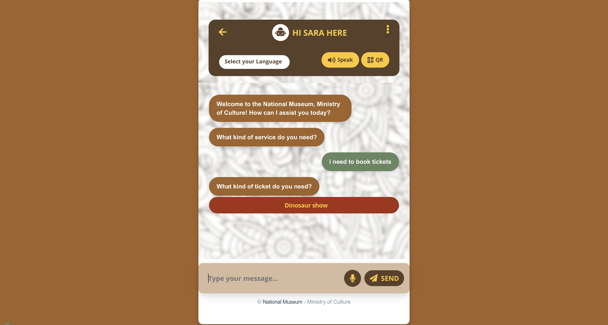
Chatbot interface

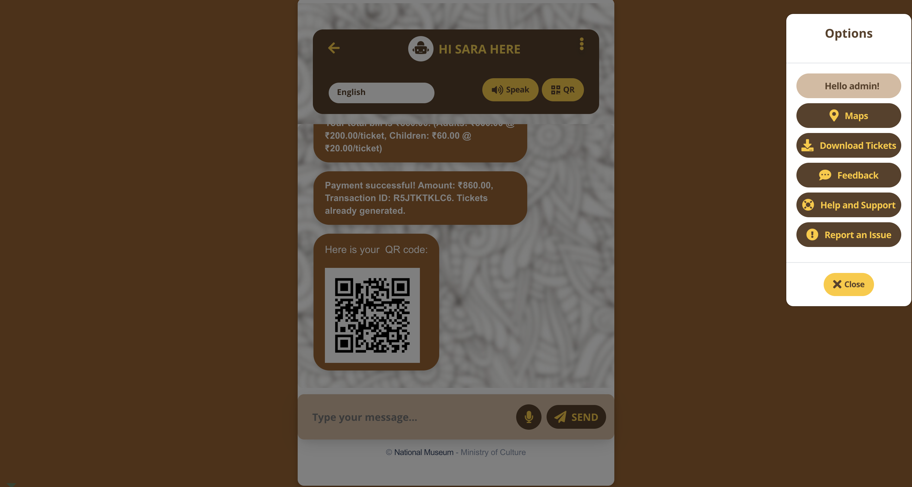
Additional Features

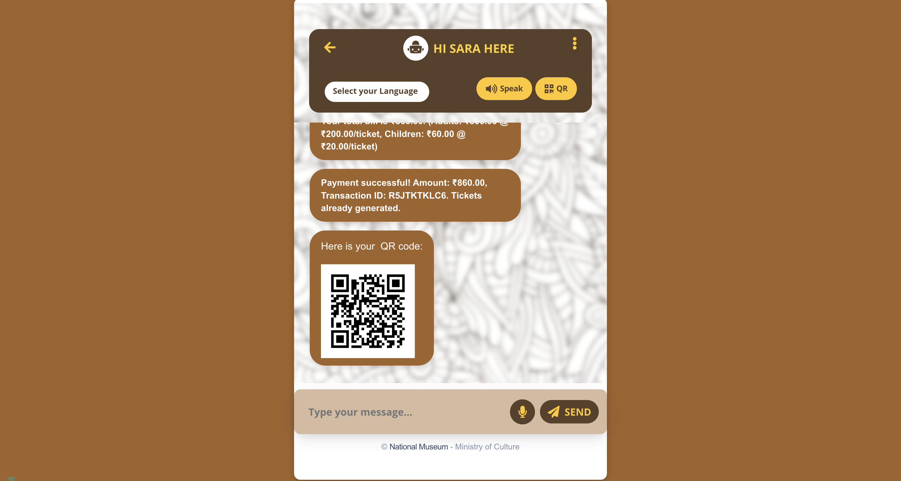
Qr Ticket generation 

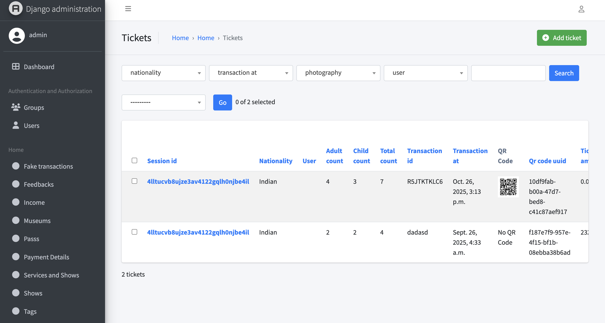
Admin Panel

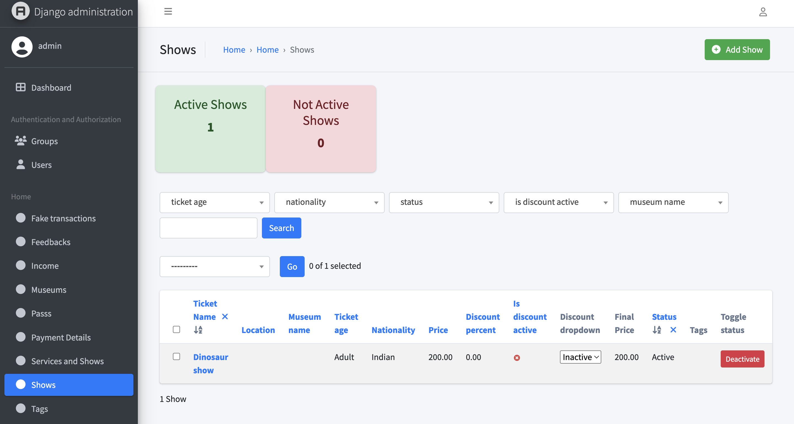
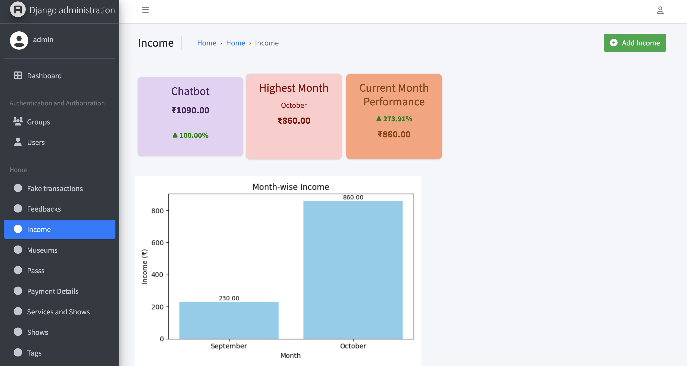
List of all the shows and transcations(admin panel)

---
## Demo

<div style="text-align: left;">
  
</div>

---
## 📧 Support
For assistance with the **Smart Group Discussion Platform**, contact us:

<div style="text-align: left;">
  
  <p>Email: <a href="mailto:adhilogu2004@gmail.com">adhilogu2004@gmail.com</a></p>
</div>

Team Members: 
- @harshithasugumar
- @balaji2k423
- @jivant
- @janani
- @umesh

[](https://www.linkedin.com/in/adithya-loganathan-a47218283/)
[](https://www.instagram.com/adithyaloganathanh/?hl=en)
[](https://github.com/adhilogu)

